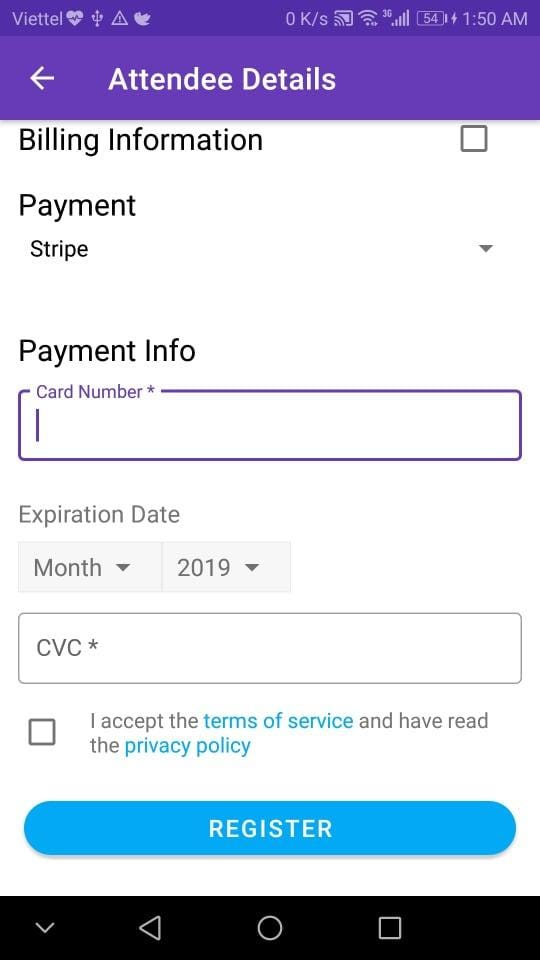

<center>

</center>

*The original blog post is posted in FOSSASIA blog site [here](https://blog.fossasia.org/implementing-stripe-payment-in-eventyay-attendee/).*

In [Eventyay Attendee](https://github.com/fossasia/open-event-attendee-android), getting tickets for events has always been a core function that we focus on. Stripe is one of the most popular payment gateways for business and it is a part of our system. Let’s take a look at the implementation

- Why using Stripe?
- Implementing Stripe Payment in Eventyay Attendee
- Conclusion
- Resources

## Why using Stripe?

There are many great APIs to be taken into consideration for making payments but we choose Stripe as one of our payment gateways because of simple implementations, detailed documentation, a good number of supported card type and good security support.

## Implementing Stripe payment in Eventyay Attendee

**Step 1:** Setup dependency in the build.gradle

```
// Stripe
implementation 'com.stripe:stripe-android:10.3.0'
```

**Step 2:** Set up UI to take card information

The information needed for making payments are `Card Number, CVC, Expiration Date`, which can be made with simple UI (EditText, Spinner,…). Stripe support getting information with CardInputWidget but we made a custom UI for that. Here is the UI we created.

<center>

</center>

**Step 3:** Create a card and validate information

Stripe has an object called Card, which takes card number, expiration date and CVC number as parameter to detect the card type and validate the card information with function `.validateCard()`

```
PAYMENT_MODE_STRIPE -> {
   card = Card.create(rootView.cardNumber.text.toString(), attendeeViewModel.monthSelectedPosition,
       rootView.year.selectedItem.toString().toInt(), rootView.cvc.text.toString())
   if (!card.validateCard()) {
       rootView.snackbar(getString(R.string.invalid_card_data_message))
       false
   } else {
       true
   }
}
```

**Step 4:** Send the token to the server

If card information is valid, we can create a token from the Card and then send it to the server. The token will act as the identifier of the card in order for the server to charge the payment and create tickets for the user.

```
private fun sendToken(card: Card) {
   Stripe(requireContext())
       .createToken(card, BuildConfig.STRIPE_API_KEY, object : TokenCallback {
           override fun onSuccess(token: Token) {
               val charge = Charge(attendeeViewModel.getId().toInt(), token.id, null)
               attendeeViewModel.chargeOrder(charge)
           }
           override fun onError(error: Exception) {
               rootView.snackbar(error.localizedMessage.toString())
           }
       })
}
```

**Step 5:** So the rest is already handled by the server. Android application will then just receive the response from the server to see if the order is charged successfully or not.

## Conclusion

With Stripe, user can easily make payments to get tickets for events. Stripe is a great payment gateway as it is really easy to implement in Android. Hopefully, this blog post will help you create a great shopping cart app or any kind of application that requires fast, simple and easy payments.

## Resources

- Eventyay Attendee Pull Request on Stripe: https://github.com/fossasia/open-event-attendee-android/pull/1863

- Documentation from Stripe for Android: https://stripe.com/docs/mobile/android